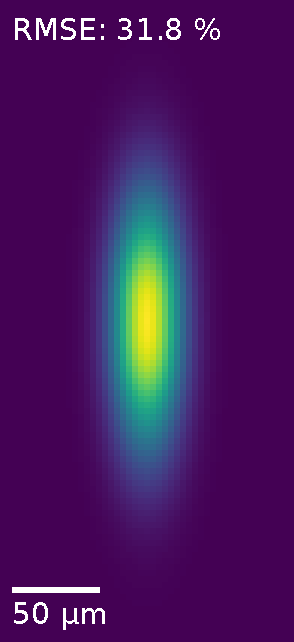

# HoloGradPy

<!-- intro-start -->
HoloGradPy optimizes SLM phase patterns for target intensity and phase profiles in the
Fourier plane using gradient-based algorithms.

The speckle-free intensity profiles it generates are used as, for example, top-hat
Rydberg addressing beams in neutral atom array experiments.

HoloGradPy implements calibration and camera feedback techniques so that the calculated
SLM phase patterns produce accurate **experimental** results.

It is built on differentiable PyTorch models of the optical setup that capture
experimental effects such as aberrations in the optical system and pixel crosstalk on
the SLM.
Once the model is calibrated, residual inhomogeneities in the measured intensity profile
can be corrected using camera feedback.

The aim is to make these algorithms more accessible, so research groups can use SLMs as
a tool without the agonizing pain <a href="#ref1">[1]</a>.
<!-- intro-end -->

Have a look at the
 [documentation](https://hologradpy.readthedocs.io/en/latest/).
The results in our publications, listed below, were generated using the algorithms in
this package.

<!-- docs-start -->

## Features

- **SLM phase optimization**

  Optimization of SLM phase patterns for arbitrary target intensity profiles, by
  conjugate gradient minimization <a href="#ref2">[2]</a> of flexible cost functions,
  allowing for simultaneous phase and amplitude control in the Fourier plane
  <a href="#ref3">[3]</a>. A vortex annihilation scheme actively removes optical
  vortices to prevent the gradient-based algorithms from stagnating.

- **Differentiable optical models**

  The optical path from the SLM to the camera is built from PyTorch modules, so
  simulated camera images are differentiable with respect to the SLM phase and every
  model parameter. Parameterized layers can model optical aberrations or pixel crosstalk
  on the SLM, making the optimization algorithms above aware of these experimental
  effects, and reducing errors in the **experimental** intensity pattern.

- **SLM calibration**

  Each of these layers needs to be calibrated. The intensity and phase profile of the
  beam incident onto the SLM can be calibrated in a few minutes using a stochastic
  method based on speckle intensity patterns. An interferometric raster-scan
  calibration <a href="#ref4">[4]</a> that is robust to beam pointing instability is
  included as well. Pixel crosstalk on the SLM is calibrated using the same
  speckle-based method.

- **Camera feedback**

  A feedback algorithm <a href="#ref5">[5]</a> measures the intensity profile on the
  camera and uses the gradient-based algorithms above to correct residual errors that
  even a well-calibrated model of the setup cannot predict.

- **Hardware interface**

  A small native SLM and camera layer with fully simulated devices for development
  without hardware. Includes adapters for
  [slmsuite](https://slmsuite.readthedocs.io/en/latest/), which covers most commercially
  available SLMs and many camera models.

## About

I wrote this package during my PhD in Prof. Stefan Kuhr's lab at the
[Ultracold Matter and Quantum Technology](https://umqt.phys.strath.ac.uk/) group of the
University of Strathclyde, where we investigated SLM-generated potentials for quantum
gas microscopes.

I now maintain it in Prof. Jonathan Pritchard's
[SQuAre](https://umqt.phys.strath.ac.uk/ryd-projects/scalable-qubit-arrays/) lab, where
its algorithms are used for top-hat beam shaping. Many thanks to Daniel Walker, who
turned some of my PhD spaghetti code into something modular and easy to use for our atom
array experiments. Much of what I learned from him has fed back into this package.

<!-- contact-start -->
For questions or suggestions, email
[paul.schroff@strath.ac.uk](mailto:paul.schroff@strath.ac.uk).
<!-- contact-end -->

## Citing HoloGradPy

Please cite whichever is relevant to what you used.

**Phase retrieval with camera feedback using pixel crosstalk modelling**

> P. Schroff, A. La Rooij, E. Haller and S. Kuhr,
> *Accurate holographic light potentials using pixel crosstalk modelling*,
> Sci. Rep. **13**, 3252 (2023).
> [https://doi.org/10.1038/s41598-023-30296-6](https://doi.org/10.1038/s41598-023-30296-6)

**Speckle calibration and pixel crosstalk optimization**

> P. Schroff, E. Haller, S. Kuhr and A. La Rooij,
> *Rapid stochastic spatial light modulator calibration and pixel crosstalk optimization*,
> Opt. Express **32**, 48957 (2024).
> [https://doi.org/10.1364/OE.539548](https://doi.org/10.1364/OE.539548)

## References

1. J. R. Shewchuk,
   *An Introduction to the Conjugate Gradient Method Without the Agonizing Pain*,
   Carnegie Mellon University (1994).
   <https://www.cs.cmu.edu/~quake-papers/painless-conjugate-gradient.pdf>

2. T. Harte, G. D. Bruce, J. Keeling and D. Cassettari,
   *Conjugate gradient minimisation approach to generating holographic traps for
   ultracold atoms*, Opt. Express **22**, 26548 (2014).
   <https://doi.org/10.1364/OE.22.026548>

3. D. Bowman, T. L. Harte, V. Chardonnet, C. De Groot,
   S. J. Denny, G. Le Goc, M. Anderson, P. Ireland, D. Cassettari and G. D. Bruce,
   *High-fidelity phase and amplitude control of phase-only computer generated
   holograms using conjugate gradient minimisation*,
   Opt. Express **25**, 11692 (2017).
   <https://doi.org/10.1364/OE.25.011692>

4. P. Zupancic, P. M. Preiss, R. Ma, A. Lukin, M. E. Tai,
   M. Rispoli, R. Islam and M. Greiner,
   *Ultra-precise holographic beam shaping for microscopic quantum control*,
   Opt. Express **24**, 13881 (2016).
   <https://doi.org/10.1364/OE.24.013881>

5. G. D. Bruce, M. Y. H. Johnson, E. Cormack, D. A. W. Richards, J.
   Mayoh and D. Cassettari,
   *Feedback-enhanced algorithm for aberration correction of holographic atom traps*,
   J. Phys. B: At. Mol. Opt. Phys. **48**, 115303 (2015).
   <https://doi.org/10.1088/0953-4075/48/11/115303>
