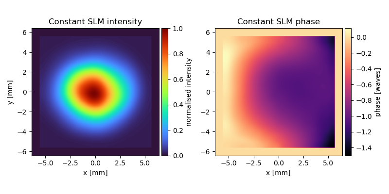
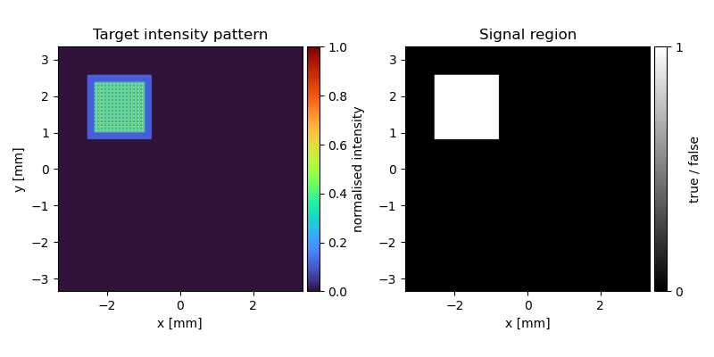
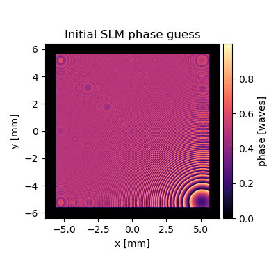
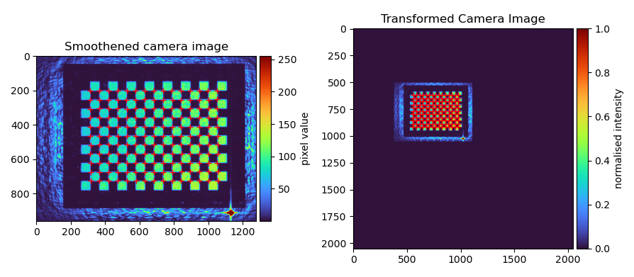
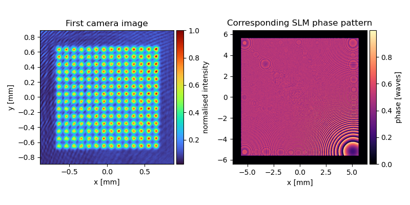
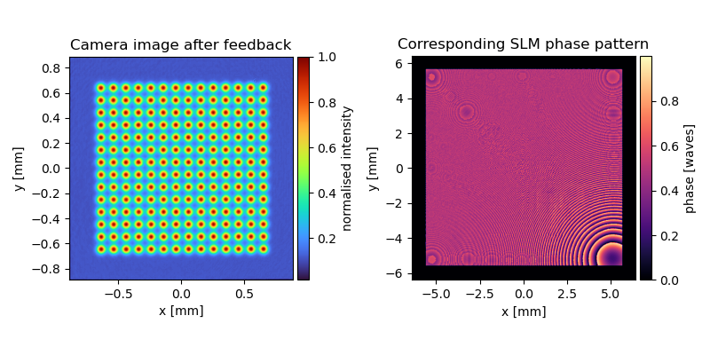
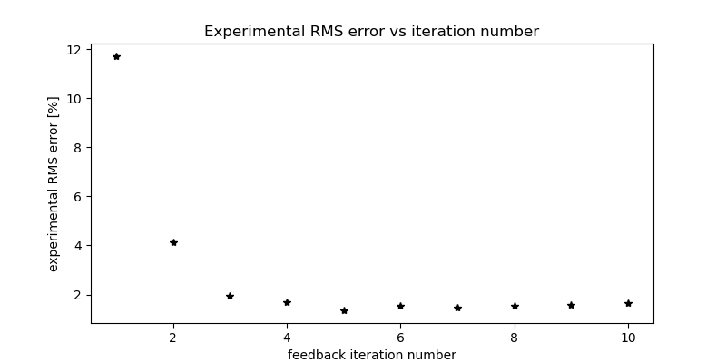

.. DO NOT EDIT.
.. THIS FILE WAS AUTOMATICALLY GENERATED BY SPHINX-GALLERY.
.. TO MAKE CHANGES, EDIT THE SOURCE PYTHON FILE:
.. "auto_examples\feedback.py"
.. LINE NUMBERS ARE GIVEN BELOW.

.. only:: html

    .. note::
        :class: sphx-glr-download-link-note

        :ref:`Go to the end <sphx_glr_download_auto_examples_feedback.py>`
        to download the full example code

.. rst-class:: sphx-glr-example-title

.. _sphx_glr_auto_examples_feedback.py:

Feedback algorithm example
==========================

This script calculates phase patterns for a phase-modulating liquid crystal on silicon (LCOS) spatial light modulator
(SLM) to create accurate light potentials by modelling pixel crosstalk on the SLM and using conjugate gradient (CG)
minimisation with camera feedback (see https://doi.org/10.1038/s41598-023-30296-6).

Using this script, it should be easy to switch between the different patterns from our publication, turn on pixel
crosstalk modelling and switch between the fast Fourier transform (FFT) and the angular spectrum method (ASM) to model
the propagation of light.

.. GENERATED FROM PYTHON SOURCE LINES 15-17

Importing modules
-----------------

.. GENERATED FROM PYTHON SOURCE LINES 17-31

.. code-block:: default

    import os
    import time
    import numpy as np
    import matplotlib.pyplot as plt
    from mpl_toolkits.axes_grid1 import make_axes_locatable

    from src.hologradpy import patterns as p
    from src.hologradpy import error_metrics as m
    from src.hologradpy import calibrate_slm as clb
    from src.hologradpy import torch_functions as tfn

    from examples.experiment import Params, Camera, SlmDisp

.. GENERATED FROM PYTHON SOURCE LINES 32-33

Here, we determine which computing hardware to use (CPU or GPU) and create instances from our custom hardware classes.

.. GENERATED FROM PYTHON SOURCE LINES 33-40

.. code-block:: default

    device = tfn.check_device(verbose=True)   # Check for GPU

    pms_obj = Params()
    cam_obj = Camera(np.array([960, 1280]), 3.75e-6, bayer=True)    # Create instance of camera class
    slm_disp_obj = SlmDisp(np.array([1024, 1280]), 12.5e-6)         # Create instance of SLM class

.. GENERATED FROM PYTHON SOURCE LINES 41-44

Initializing the camera feedback algorithm
------------------------------------------
Parameters for the phase-retrieval algorithm:

.. GENERATED FROM PYTHON SOURCE LINES 44-62

.. code-block:: default

    npix = 1024                 # Number of pixels on SLM (npix * npix)
    propagation_type = 'fft'    # Propagation Type
    optimizer = 'cg'            # Optimizer
    loss_fn = 'amp'             # Loss function used during optimization
    fft_shift = True            # Perform FFT shift?
    precision = 'single'        # Computational precision
    pixel_crosstalk = False     # Model pixel crosstalk?
    pix_res = 1                 # Subsampling factor of each SLM pixel
    detect_vortices = False     # Detect vortices before the first camera feedback iteration?
    threshold_vtx = 0.05        # Vortices are only detected in regions brighter than threshold (1 is maximum)

    # Path containing a previously calculated affine transform to calibrate the camera.
    tf_path = pms_obj.data_path + '23-08-29_18-42-53_torch_camcal/'

    calc_transform = True           # Calculate new transform?
    measure_slm_intensity = False   # Measure the constant intensity at the SLM (laser beam profile)?
    measure_slm_phase = False       # Measure the constant phase at the SLM?

.. GENERATED FROM PYTHON SOURCE LINES 63-64

Parameters for the initial SLM phase guess, the target light potential and the signal region:

.. GENERATED FROM PYTHON SOURCE LINES 64-79

.. code-block:: default

    guess_type = 'guess'                                            # Use analytical phase guess
    phase_angle = int(-npix // 4)                                   # Offset of the target light potential to the optical
                                                                    # axis in x- and y-direction in Fourier pixels to
                                                                    # calculate the gradient of linear phase.
    linear_phase = np.array([phase_angle + 2, phase_angle - 2])   # Linear term of the initial phase guess
    quad_phase = np.array([4.7e-4, 0.5])                            # Quadratic term of the initial phase guess

    # Target Pattern
    pattern = 'spot_array'                                          # Name of the target light potential
    mask_pos = int(phase_angle)                                     # Offset of the target light potential to the optical
                                                                    # axis in x- and y-direction in Fourier pixels
    target_width = int(npix // 2)                                   # Size of the target light potential
    target_blur = 2                                                 # Width of the blurring kernel for the target light
                                                                    # potential

.. GENERATED FROM PYTHON SOURCE LINES 80-81

Parameters for the camera feedback algorithm:

.. GENERATED FROM PYTHON SOURCE LINES 81-90

.. code-block:: default

    cam_name = 'before'                     # Name of camera
    slm_disp_type = 'lut'                   # SLM display mode
    iter_fb = 10                            # Number of camera feedback iterations
    iter_cg = 50 * np.ones(iter_fb)         # Number of CG iterations per feedback iteration
    alpha = np.ones(iter_fb)                # Feedback gain parameter
    exp_time = 200                          # Exposure time of camera in microseconds
    n_frames_avg = 10                       # Number of camera pictures taken to average
    feedback_blur = 0                       # Size of Gaussian blurring for camera feedback

.. GENERATED FROM PYTHON SOURCE LINES 91-92

Defining the blurring kernel to model pixel crosstalk:

.. GENERATED FROM PYTHON SOURCE LINES 92-100

.. code-block:: default

    if pixel_crosstalk is True:
        extent = 3                          # Extent of crosstalk kernel in SLM pixels
        q = 2.3                             # Crosstalk kernel order
        sigma = 0.92 / slm_disp_obj.pitch   # Crosstalk kernel width
        kernel_ct = p.pixel_ct_kernel(slm_disp_obj.pitch, pix_res, extent, q, sigma)
    else:
        kernel_ct = None

.. GENERATED FROM PYTHON SOURCE LINES 101-102

Inputs for the angular spectrum method:

.. GENERATED FROM PYTHON SOURCE LINES 102-114

.. code-block:: default

    # Number of pixels of zero-padded SLM plane
    if propagation_type == 'asm':
        npix_pad = int(pms_obj.lens_aperture // pms_obj.slm_pitch)
    else:
        npix_pad = 2 * npix

    npix_tot = npix_pad * pix_res                   # Total number of pixels (npix_tot * npix_tot)
    extent_lens = npix_pad * slm_disp_obj.pitch     # Spatial extent of computational lens plane [m]
    pd1 = pms_obj.fl                                # Distance from SLM plane to lens plane [m]
    pd2 = pms_obj.fl                                # Distance from lens plane to camera plane [m]

.. GENERATED FROM PYTHON SOURCE LINES 115-116

Determine which data to save.

.. GENERATED FROM PYTHON SOURCE LINES 116-126

.. code-block:: default

    save = False                    # Save camera images?
    convergence = False             # Save convergence of CG algorithm?
    n_save = 5                      # Save every xx th CG iteration
    iter_plot = [1, 2, 13, 14, 15]  # List of feedback iterations to save CG convergence

    # Create folder to save data
    date_saved = time.strftime('%y-%m-%d_%H-%M-%S', time.localtime())
    path = pms_obj.data_path + date_saved + '_' + os.path.splitext(os.path.basename(__file__))[0] + '_' + pattern
    os.mkdir(path)

.. GENERATED FROM PYTHON SOURCE LINES 127-131

Measuring the constant intensity and phase at the SLM
-----------------------------------------------------
Measuring the constant intensity and phase at the SLM is crucial for accurate experimental results - see the
supplementary information of our publication for details.

.. GENERATED FROM PYTHON SOURCE LINES 131-138

.. code-block:: default

    if measure_slm_intensity is True:
        i_path = clb.measure_slm_intensity(slm_disp_obj, cam_obj, pms_obj, 30, 32, 10000, 256, 300)
        pms_obj.i_path = i_path + '//i_rec.npy'
    if measure_slm_phase is True:
        phi_path = clb.measure_slm_wavefront(slm_disp_obj, cam_obj, pms_obj, 30, 16, 64, 40000, 256, roi_min_x=2,
                                             roi_min_y=2, roi_n=26)
        pms_obj.phi_path = phi_path + '//dphi_uw.npy'

.. GENERATED FROM PYTHON SOURCE LINES 139-143

Using the functions above, this is our constant field at the SLM after upscaling it to the native resolution of the
SLM:

.. GENERATED FROM PYTHON SOURCE LINES 145-155

Defining the target light potential
-----------------------------------
The ``patterns.Hologram`` class contains pre-defined patterns from our publication. It creates

- the upscaled measured constant SLM phase and intensity,
- the initial SLM phase guess,
- the target intensity pattern,
- and the signal region.

Feel free to define the arrays above yourself - using the ``patterns.Hologram`` class is not mandatory.

.. GENERATED FROM PYTHON SOURCE LINES 155-161

.. code-block:: default

    holo = p.Hologram(slm_disp_obj, pms_obj, pattern, npix, npix_pad=npix_pad, pix_res=pix_res, phase_guess_type=guess_type,
                      linear_phase=linear_phase, quadratic_phase=quad_phase, slm_field_type='measured',
                      propagation_type=propagation_type, target_position=mask_pos, target_width=target_width,
                      target_blur=target_blur)

.. GENERATED FROM PYTHON SOURCE LINES 162-175

Here is our target light potential, a Gaussian spot array, and the signal region:

The target is shifted away from the center to avoid the zeroth order diffration spot. The phase retrieval algorithm
only optimises for the intensity inside the signal region.

We use an analytic initial SLM phase guess consisting of a quadratic and a linear phase term. The quadratic phase term
depends on the size and the aspect ratio of the target pattern while the linear term depends on the position of the
pattern with respect to the optical axis. The initial phase guess defined here looks like this:

.. GENERATED FROM PYTHON SOURCE LINES 177-182

Creating a virtual SLM object
-----------------------------
This is a digital twin of the experimental Fourier holography setup. The ``forward`` method of ``VirtualSlm`` takes an
SLM phase pattern, models pixel crosstalk on the SLM and the propagation of light from the SLM to the camera. It
returns the electric field at the image plane.

.. GENERATED FROM PYTHON SOURCE LINES 182-197

.. code-block:: default

    # Create SLM mask to set unused pixels to zero
    slm_mask = np.zeros((npix, npix))
    slm_mask[pms_obj.crop:-pms_obj.crop, pms_obj.crop:-pms_obj.crop] = 1

    # Pixel pitch in the Fourier plane (padded) [m]
    img_pitch = pms_obj.wavelength * pms_obj.fl / (slm_disp_obj.pitch * slm_disp_obj.res[0] * 2)
    xf = -256 * img_pitch  # ToDO: Explain this.

    # Create virtual SLM object
    slm_obj = tfn.VirtualSlm(slm_disp_obj, pms_obj, holo.phi_init, npix_pad, npix=npix, e_slm=holo.e_slm,
                             kernel_ct=kernel_ct, pix_res=pix_res, propagation_type=propagation_type,
                             extent_lens=pms_obj.lens_aperture, pd1=pd1, pd2=pd2, xf=xf, device=device, slm_mask=slm_mask,
                             precision=precision, fft_shift=fft_shift).to(device)

.. GENERATED FROM PYTHON SOURCE LINES 198-202

Camera calibration
------------------
Here, we calculate the affine transformation matrix between camera coordinates and image plane coordinates. This is
important to compare the simulated light potential to the captured camera image.

.. GENERATED FROM PYTHON SOURCE LINES 202-211

.. code-block:: default

    if calc_transform is False:
        tf = np.load(tf_path + 'tf.npy')
        itf = np.load(tf_path + 'itf.npy')
    else:
        # ToDO: Control over checkerboard position missing.
        tf, itf = tfn.camera_calibration(slm_obj, slm_disp_obj, cam_obj, pms_obj, save=True, exp_time=1000,
                                         checkerboard_rows=16, checkerboard_columns=12, checkerboard_square_size=30)

.. GENERATED FROM PYTHON SOURCE LINES 212-218

This is the result:

Note that the zeroth-order diffraction spot is now located in the center of the computational image plane on the right
hand side.

.. GENERATED FROM PYTHON SOURCE LINES 220-232

Running the camera feedback algorithm
-------------------------------------
First, we create an object from ``torch_functions.PhaseRetrieval`` which sets the phase retrieval method. By default,
``torch_functions.PhaseRetrieval`` performs conjugate gradient minimisation using an amplitude-only cost function (see
https://doi.org/10.1364/OE.22.026548).

This phase retrieval method is then used iteratively by the camera feedback algorithm
(see https://dx.doi.org/10.1088/0953-4075/48/11/115303).

Before running the camera feedback algorithm, we set the phase of the virtual SLM , ``slm_obj``, with the initial
phase guess. The phase pattern of ``slm_obj`` might have been modified by the ``torch_functions.camera_calibration``
function.

.. GENERATED FROM PYTHON SOURCE LINES 232-250

.. code-block:: default

    phase_retrieval_obj = tfn.PhaseRetrieval(slm_obj, n_iter=int(iter_cg[0]), i_tar=holo.i_tar, signal_region=holo.sig_mask,
                                             save=convergence, n_save=n_save)

    if propagation_type == 'asm':
        # Modify the initial phase pattern on our virtual SLM if the ASM is used.
        slm_obj.set_phi(holo.phi_init - slm_obj.asm_obj.phi_q_native)
    else:
        phase_retrieval_obj.slm_obj.set_phi(holo.phi_init)

    # Run camera feedback algorithm
    output = tfn.camera_feedback(phase_retrieval_obj, slm_disp_obj, cam_obj, tf, itf, iter_fb=iter_fb, iter_cg=iter_cg,
                                 detect_vortices=detect_vortices, threshold_vtx=threshold_vtx, n_save=n_save,
                                 n_avg=n_frames_avg, exp_time=exp_time, fb_blur=feedback_blur, alpha=alpha,
                                 convergence=convergence, iter_convergence=iter_plot, path=path)

    phi, img, M, T, [rmse, psnr], [rmse_conv_sv, rmse_pred_conv_sv, eff_conv_sv, n_conv_sv] = output

.. GENERATED FROM PYTHON SOURCE LINES 251-260

After the first 50 CG iterations, the optimised SLM phase pattern is displayed on the device and a camera image is
taken:

The experimental errors in the camera image are greatly reduced after 10 camera feedback iterations with 50 CG
iterations each:

.. GENERATED FROM PYTHON SOURCE LINES 260-274

.. code-block:: default

    # Transfer electric field in the image plane to CPU
    e_out = tfn.gpu_to_numpy(slm_obj())

    # Calculate intensity pattern of the simulated light potential
    i_out = np.abs(e_out) ** 2

    # Calculate phase pattern of simulated light potential
    phi_out = np.angle(e_out)

    # Calculate efficiency
    eff = m.eff(holo.sig_mask, i_out)
    print('Efficiency of the simulation:', eff * 100, '%')

.. GENERATED FROM PYTHON SOURCE LINES 275-277

Plotting
--------

.. GENERATED FROM PYTHON SOURCE LINES 277-290

.. code-block:: default

    px = 1 / plt.rcParams['figure.dpi']
    fig0, axs0 = plt.subplots(figsize=(800*px, 400*px))
    plt.plot(np.arange(1, iter_fb + 1), rmse * 100, 'k*', label='RMS error')
    plt.title('Experimental RMS error vs iteration number')
    plt.xlabel('feedback iteration number')
    plt.ylabel('experimental RMS error [%]')

    plt.figure()
    plt.plot(psnr, 'go', label='PSNR')
    plt.title('Experimental PSNR vs iteration number')
    plt.xlabel('experimental iteration number')
    plt.ylabel('PSNR [dB]')

.. GENERATED FROM PYTHON SOURCE LINES 291-296

We can now plot the rms error of the camera images after each feedback iteration:

The feedback algorithm lowered rms error from ~12 % to ~1.6 %.

.. GENERATED FROM PYTHON SOURCE LINES 296-322

.. code-block:: default

    plt.figure()
    plt.imshow(i_out, cmap='turbo')
    plt.title('Simulated light potential')

    plt.figure()
    plt.imshow(phi_out, cmap='magma')
    plt.title('Phase of simulated light potential')

    plt.figure()
    plt.imshow(img[..., -1].squeeze(), cmap='turbo')
    plt.title('Camera image')
    plt.savefig(path + '//img.pdf', dpi=1200)

    target_norm = T[..., 0].squeeze() * tfn.camera_feedback.sig_mask_tf
    mask_target = target_norm > 0.1 * np.max(target_norm)
    target_norm = target_norm / np.sum(target_norm[mask_target])

    img_norm = img[..., 3].squeeze() * mask_target
    img_norm = img_norm / np.sum(img_norm)
    diff_img = (img_norm - target_norm) * mask_target

    plt.figure()
    plt.imshow(diff_img, cmap='seismic', vmin=-np.max(np.abs(diff_img)), vmax=np.max(np.abs(diff_img)))

.. GENERATED FROM PYTHON SOURCE LINES 420-424

We can investigate the convergence of the phase retrieval algorithm in-between feedback iterations by saving
intermediate phase patterns, displaying them on the SLM and capturing the resulting camera image. This allows us to
see when the rms error of the camera image converges to determine the number of CG iterations needed per feedback
iteration.

.. GENERATED FROM PYTHON SOURCE LINES 424-456

.. code-block:: default

    # Plot and save convergence graphs
    if convergence is True:
        plt.figure('rmse')
        x = min(iter_plot)
        for i in range(len(iter_plot)):
            plt.figure('rmse')
            x = np.linspace(iter_plot[i] - 1 + 1 / iter_cg[iter_plot[i] - 1],
                            iter_plot[i] - 1 + n_conv_sv[i] * n_save / iter_cg[iter_plot[i] - 1], n_conv_sv[i])
            line_exp, = plt.plot(x, rmse_conv_sv[i] * 100, '-', color='C0')
            line_pred, = plt.plot(x, rmse_pred_conv_sv[i] * 100, '--', color='r')

            plt.figure('eff')
            plt.plot(x, eff_conv_sv[i] * 100, '-', color='C1')

        line_exp.set_label('experiment')
        line_pred.set_label('predicted')

        plt.figure('rmse')
        plt.plot(np.arange(1, iter_fb + 1), rmse * 100, 'k*', label='RMS within 50% of max. intensity')
        plt.legend()
        plt.xlabel('CG iterations')
        plt.ylabel('RMS error [%]')
        plt.grid()
        plt.savefig(path + '//rmse.pdf', bbox_inches='tight', dpi=600)

        plt.figure('eff')
        plt.xlabel('CG iterations')
        plt.ylabel('Predicted efficiency [%]')
        plt.grid()
        plt.savefig(path + '//efficiency.pdf', bbox_inches='tight', dpi=600)

.. GENERATED FROM PYTHON SOURCE LINES 457-460

Saving data
-----------
Saving data to the hard drive.

.. GENERATED FROM PYTHON SOURCE LINES 460-492

.. code-block:: default

    if save is True:
        np.save(path + '//lin_phase', linear_phase)
        np.save(path + '//quad_phase', quad_phase)
        np.save(path + '//tf', tf)
        np.save(path + '//itf', itf)
        np.save(path + '//T', T)
        np.save(path + '//npix', npix)
        np.save(path + '//npix_pad', npix_pad)
        np.save(path + '//pix_res', pix_res)
        np.save(path + '//M', M)
        np.save(path + '//img', img)
        np.save(path + '//phi', phi)
        np.save(path + '//prop', propagation_type)
        np.save(path + '//exp_time', exp_time)
        np.save(path + '//kernel_ct', kernel_ct)

        np.save(path + '//rmse', rmse)
        np.save(path + '//eff', eff)
        np.save(path + '//psnr', psnr)

        np.save(path + '//rmse_conv_sv', rmse_conv_sv)
        np.save(path + '//rmse_pred_conv_sv', rmse_pred_conv_sv)
        np.save(path + '//eff_conv_sv', eff_conv_sv)
        np.save(path + '//n_conv_sv', n_conv_sv)
        np.save(path + '//iter_plot', iter_plot)

        np.save(path + '//a_tar', holo.a_tar)
        np.save(path + '//sig_mask', holo.sig_mask)
        np.save(path + '//n_save', n_save)
        np.save(path + '//iter_fb', iter_fb)

.. rst-class:: sphx-glr-timing

   **Total running time of the script:** (0 minutes 0.000 seconds)

.. _sphx_glr_download_auto_examples_feedback.py:

.. only:: html

  .. container:: sphx-glr-footer sphx-glr-footer-example

    .. container:: sphx-glr-download sphx-glr-download-python

      :download:`Download Python source code: feedback.py <feedback.py>`

    .. container:: sphx-glr-download sphx-glr-download-jupyter

      :download:`Download Jupyter notebook: feedback.ipynb <feedback.ipynb>`

.. only:: html

 .. rst-class:: sphx-glr-signature

    `Gallery generated by Sphinx-Gallery <https://sphinx-gallery.github.io>`_
